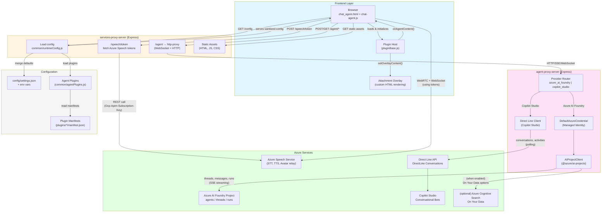

# Avatar Architecture Overview

This diagram shows the overall architecture of the avatar application, including all major components and their interactions.

## Key Components

### Frontend Layer
- **Browser UI**: Main application interface (chat_agent.html + chat-agent.js)
- **Plugin Host**: Manages plugin lifecycle and provides API for custom UI rendering
- **Attachment Overlay**: Renders custom HTML content (e.g., image carousels, interactive elements)

### services-proxy-server
- Serves static assets and handles client-facing endpoints
- Proxies agent requests to agent-proxy-server
- Manages Azure Speech token acquisition
- Merges configuration from files and environment variables

### agent-proxy-server
- Routes requests to appropriate provider (Azure AI Foundry or Copilot Studio)
- Handles authentication via DefaultAzureCredential for Azure services
- Manages Direct Line conversations for Copilot Studio integration
- Streams agent responses via Server-Sent Events (SSE)

### Azure Services
- **Azure Speech Service**: STT, TTS, and avatar relay for real-time communication
- **Azure AI Foundry**: Agent runtime with threads, messages, and runs API
- **Direct Line API**: Protocol for Copilot Studio bot communication
- **Azure Cognitive Search**: Optional On Your Data integration

### Configuration
- **settings.json**: Base configuration with defaults
- **Plugin Manifests**: Per-plugin configuration including connection details, branding, voice settings
- **Environment Variables**: Runtime overrides for sensitive values
