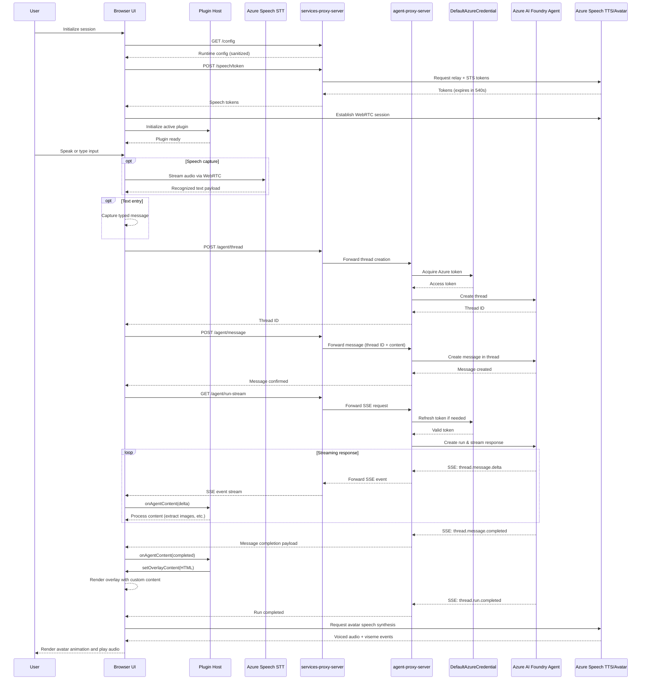
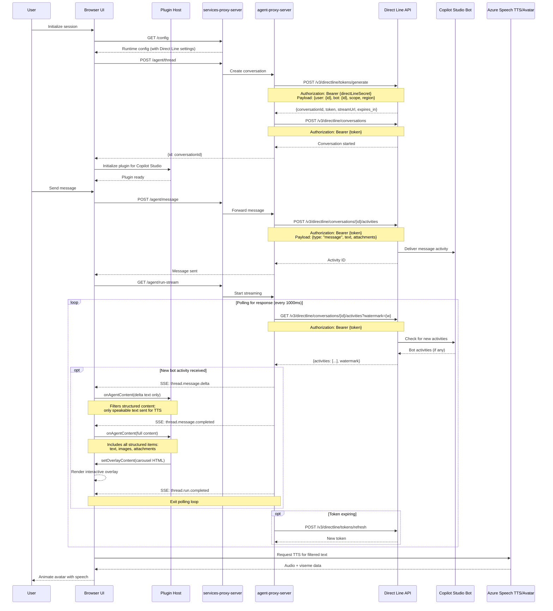

# Avatar Interaction Sequence

This diagram shows the detailed sequence of interactions during a typical user conversation with the avatar, including both Azure AI Foundry and Copilot Studio provider flows.

## Azure AI Foundry Flow

## Copilot Studio (Direct Line) Flow

## Key Differences: Azure AI Foundry vs Copilot Studio

### Azure AI Foundry
- **Authentication**: Uses DefaultAzureCredential (Managed Identity)
- **Protocol**: Native SSE streaming from Azure AI Foundry agents API
- **Message Flow**: Thread → Message → Run (async streaming)
- **Response Format**: Structured delta events with content arrays

### Copilot Studio (Direct Line)
- **Authentication**: Uses Direct Line secret (from manifest or env vars)
- **Protocol**: Direct Line REST API with polling
- **Message Flow**: Conversation → Activity → Poll for responses
- **Response Format**: Activities with text and attachments, transformed to delta events
- **Content Handling**: 
  - Delta events receive only speakable text (type: "text") for TTS
  - Completion events receive full structured content including images
  - Supports JSON-based structured content arrays

## Plugin Content Processing

Both flows support plugin-based custom rendering:

1. **Content Reception**: Plugin receives `onAgentContent(content, context)` callback
2. **Content Parsing**: Plugin extracts structured items (text, images, attachments)
3. **HTML Generation**: Plugin builds custom HTML (e.g., carousels) as strings
4. **Overlay Rendering**: Plugin calls `setOverlayContent({type: 'custom_html', html, visible})`
5. **DOM Attachment**: After rendering, plugin uses `requestAnimationFrame()` to query DOM and attach event handlers
6. **Interactive Features**: Navigation buttons, indicators, keyboard controls

## Voice Settings Priority

Voice settings follow a cascading priority system:

1. **Plugin manifest** `speech.ttsVoice` (HIGHEST)
2. **Plugin manifest** `avatar.voice`
3. **Host app** speech settings (FALLBACK)

STT locales follow the same pattern via `speech.sttLocales`.
